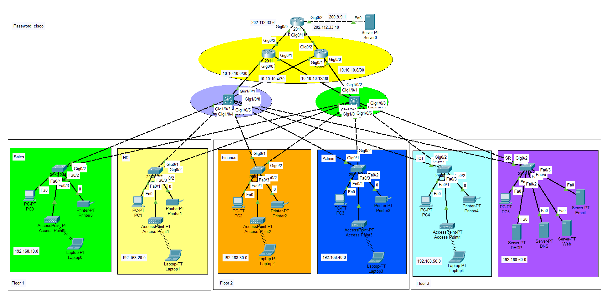

# ccna-enterprise-campus-network
Enterprise Campus Network Design using Cisco Packet Tracer featuring VLANs, Inter-VLAN Routing, HSRP, OSPF, NAT/PAT, ACLs, SSH, STP, Port Security, DHCP Relay and Wireless Access Points.
# Enterprise Campus Network Design
## Topology

## Overview

Designed and implemented a multi-department enterprise network in Cisco Packet Tracer.

The project demonstrates VLAN segmentation, dynamic routing, redundancy, security policies, and Internet connectivity commonly used in enterprise environments.

## Features

- VLAN Segmentation
- Inter-VLAN Routing
- HSRP Gateway Redundancy
- OSPF Dynamic Routing
- DHCP Relay
- ACL Security Policies
- SSH Remote Management
- NAT/PAT
- STP Root Primary/Secondary
- Port Security
- Wireless Access Points
- ISP Connectivity

## Technologies Used

- Cisco Packet Tracer
- Cisco IOS
- VLANs
- HSRP
- OSPF
- NAT/PAT
- ACLs
- STP
- Port Security
- SSH

## Verification Commands

show standby brief

show ip ospf neighbor

show ip route

show ip nat translations

show access-lists

show spanning-tree vlan 10

show port-security

## Skills Demonstrated

- Enterprise Network Design
- Routing and Switching
- Network Security
- High Availability
- Dynamic Routing
- Troubleshooting
